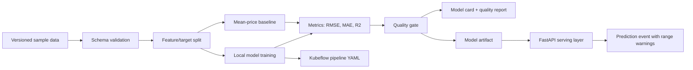
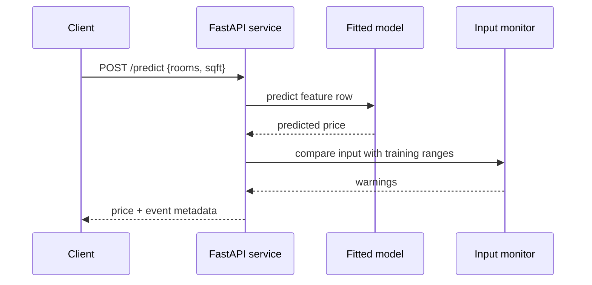

# System Design

This repository is a compact MLOps case study: one dataset, one baseline model, one quality gate, one compiled pipeline, and one lightweight serving path.

## Request Path

## Production Gaps

- Replace local pickle artifacts with a model registry.
- Add request logging to durable storage.
- Track prediction/label joins after ground truth arrives.
- Add drift dashboards for feature ranges and error metrics.
- Split the Kubeflow pipeline into data validation, training, evaluation, registration, and promotion components.
